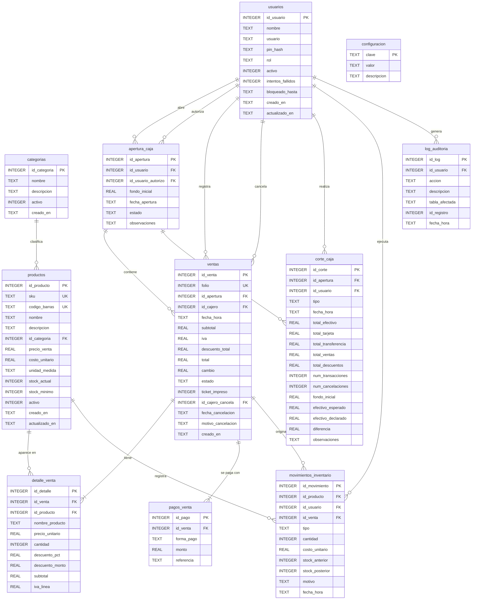

# Modelo de Datos — Sistema POS Spa Facial

**Versión:** 1.0  
**Fecha:** 2026-06-29  
**Base de datos:** SQLite 3  

---

## Diagrama Entidad-Relación

---

## Descripción de Tablas

### `categorias`
Agrupación de productos (ej. Hidratantes, Exfoliantes, Aceites). Permite filtros en el catálogo y reportes por categoría.

### `usuarios`
Usuarios del sistema con roles `administrador`, `cajero` y `esteticista`. El `pin_hash` almacena el hash del PIN numérico (bcrypt/Argon2). `intentos_fallidos` y `bloqueado_hasta` soportan la política de bloqueo de HU-01.

### `productos`
Catálogo completo. `precio_venta` incluye IVA (RN-01). El `nombre_producto` se copia en `detalle_venta` al momento de la venta para preservar el historial aunque cambie el nombre (HU-04). `stock_actual` se actualiza vía trigger o lógica de aplicación al confirmar una venta.

### `apertura_caja`
Representa un turno de caja. Una apertura en estado `abierta` debe existir para poder registrar ventas (RN-02). `id_usuario_autorizo` registra al administrador que aprobó una apertura forzada.

### `ventas`
Encabezado de cada transacción. `folio` es consecutivo e irrepetible (RN-08). `subtotal` es el monto sin IVA; `iva` es el desglose; `total` = subtotal + iva − descuento_total. Los campos de cancelación solo se llenan cuando `estado = 'cancelada'`.

### `detalle_venta`
Una fila por producto vendido. Guarda un **snapshot** de `nombre_producto` y `precio_unitario` en el momento de la venta para que el historial no cambie si se editan los datos del producto (HU-04).

### `pagos_venta`
Permite pagos mixtos (HU-06). Cada fila representa un método de pago aplicado a la venta. La suma de `monto` de todas las filas ≥ `ventas.total`.

### `corte_caja`
Registra tanto cortes parciales (tipo `X`) como cierres definitivos (tipo `Z`). `efectivo_esperado` = `fondo_inicial` + `total_efectivo` − cambios entregados. `diferencia` = `efectivo_declarado` − `efectivo_esperado` (positivo = sobrante, negativo = faltante). Solo el corte Z cierra la `apertura_caja` (RN-05).

### `movimientos_inventario`
Bitácora inmutable de cada cambio de stock. `tipo` puede ser `entrada`, `venta`, `ajuste_positivo` o `ajuste_negativo`. `id_venta` es nulo para entradas y ajustes manuales. Conserva `stock_anterior` y `stock_posterior` para trazabilidad completa (HU-12).

### `log_auditoria`
Registro inmutable de acciones críticas: cancelaciones, descuentos fuera de límite, ajustes de inventario, reimpresiones tardías. No expuesto al rol cajero (sec. 5.3).

### `configuracion`
Tabla clave-valor para parámetros del negocio: nombre del spa, RFC, dirección, tasa de IVA, descuento máximo sin autorización, logo, etc. (restricción 5.6).

---

## Notas de Diseño

| Decisión | Justificación |
|---|---|
| `precio_venta` como `REAL` | Suficiente precisión para montos < $1,000,000 MXN. Para mayor rigor financiero usar `INTEGER` de centavos. |
| Snapshot en `detalle_venta` | Cumple HU-04: el historial no se altera al editar nombre o precio del producto. |
| `pagos_venta` separada | Soporta pagos mixtos (HU-06) sin columnas nullable ni diseño rígido en `ventas`. |
| `stock_actual` en `productos` | Desnormalización intencional para consultas O(1) de stock. `movimientos_inventario` es la fuente verdadera para reconstruirlo. |
| `folio` como `INTEGER UNIQUE` | Permite verificación de secuencia con `MAX(folio)` sin depender del autoincrement de `id_venta`. |
| Fechas como `TEXT` ISO-8601 | SQLite no tiene tipo DATE nativo; `TEXT` con formato `YYYY-MM-DD HH:MM:SS` es ordenable y comparable. |
